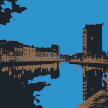

# image-art-cli

This repo implements Kmeans / Kmedians Clustering with the 
[remisultan/java-ml](https://github.com/remisultan/java-ml) repository in order to produce a 
series of photos per 'K' training.
  
You can end up having a series of image looking like these:

 
 
 


## Requirements

- JDK17+
- [remisultan/java-ml](https://github.com/remisultan/java-ml) repository (Make sure to build the project above with the correct version before running this project)

## Getting started

Clone the repo and execute this

### Kmeans / kMedians
```bash
 $ ./mvnw clean install
 $ bash -x kmedoid.sh MEAN 100 /path/to/file.jpg /path/to/file/prefix 3 5 8 10 20 50 100 200
```

### Principal Component Analysis
```bash
 $ ./mvnw clean install
 $ bash -x pca.sh /path/to/file.jpg /path/to/file/prefix 200 250 300 350 460 512
```

### Isolation Forests
```bash
 $ ./mvnw clean install
 $  bash -x iforest.sh EXTENDED /path/to/file.jpg /path/to/file/prefix 10 
```

Good luck !

